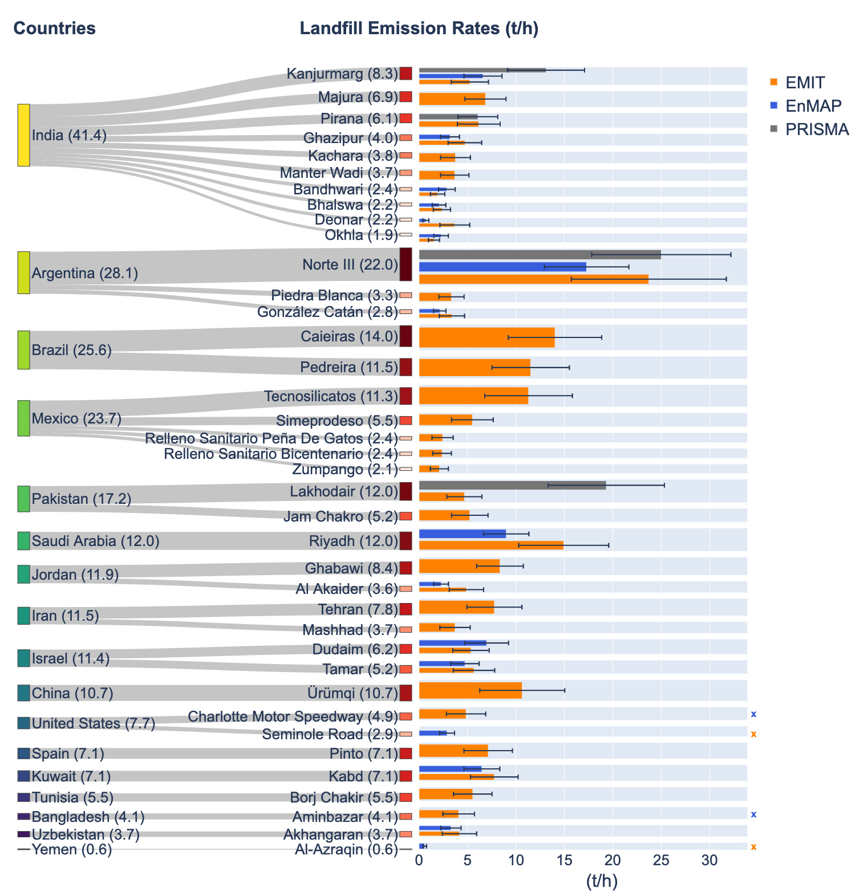

# Hyper-Landfill

## Usage

This repository contains scripts and a selection of data used in the ES&T paper "Global Identification of Solid Waste Methane Super Emitters Using Hyperspectral Satellites."

All input data are available in the Zenodo dataset titled ["Dataset for Global Identification of Solid Waste Methane Super Emitters Using Hyperspectral Satellites"](https://doi.org/10.5281/zenodo.13643544).

To use the data, download the compressed file, extract it into the root directory, and rename the folder to "data.". This will ensure that all Jupyter Notebooks run correctly.

## Notebook structure

- emission_summary.ipynb
    
    Table S2 and S3; Generating summary data

- emission_map.ipynb

    Fig. 1 and S7

- hyper_sankey.ipynb

    Fig. 2 and S9

- emission_comp_th.ipynb

    Fig. 3 and S13; Table S4, S5, S6, S7, and S8

- emission_timeseries.ipynb

    Fig. 4, S14, and S15

- errors.ipynb

    Fig. S1

- emission_stats.ipynb

    Fig. S8 and S10

- climatetrace_stats.ipynb

    Fig. S11

- s2_landfill.ipynb

    Fig. S12, S17, and S18

- animation.ipynb

    Movie S1 and S2

## Reference

Zhang, Xin, et al. "Global identification of solid waste methane super emitters using hyperspectral satellites." (2025, under review).